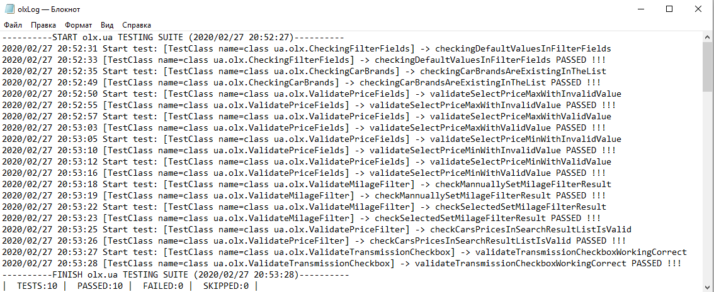

# Framework for testing the 'olx.ua' site

This is a simple project designed to test the 'olx.ua' site.

Testing may be conducted using Chrome or Firefox browsers. You have to use **chrome** value for variable **driver** in the ***WebDriver.properties*** file for running tests in Chrome web browser or **gecko** value for running tests in Firefox web browser.
You can also set values for **implicitWait** and **explicitWait** in the ***WebDriver.properties*** file.

There are 10 tests in this framework. They are:
* checkingCarBrandsAreExistingInTheList
* checkingDefaultValuesInFilterFields
* checkMannuallySetMilageFilterResult
* checkSelectedSetMilageFilterResult
* validateSelectPriceMinWithInvalidValue
* validateSelectPriceMinWithValidValue
* validateSelectPriceMaxWithInvalidValue
* validateSelectPriceMaxWithValidValue
* checkCarsPricesInSearchResultListIsValid
* validateTransmissionCheckboxWorkingCorrect

The results of tests after execution are written to a file ***olxLog.log*** as follows:

